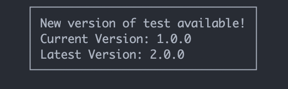

# simple-update-notifier

Simple update notifier to check for npm updates for cli applications with zero dependencies.



Checks for updates for an npm module and outputs to the command line if there is one available. The result is cached for the specified time so it doesn't check every time the app runs.

## Install

```bash
npm install simple-update-notifier
OR
yarn add simple-update-notifier
```

## Usage

```js
import updateNotifier from 'update-notifier';
import packageJson from './package.json' assert { type: 'json' };

updateNotifier({ pkg: packageJson });
```

### Options

#### pkg

Type: `object`

##### name

_Required_\
Type: `string`

##### version

_Required_\
Type: `string`

#### updateCheckInterval

Type: `number`\
Default: `1000 * 60 * 60 * 24` _(1 day)_
How often to check for updates.

#### shouldNotifyInNpmScript

Type: `boolean`\
Default: `false`

Allows notification to be shown when running as an npm script.

#### distTag

Type: `string`\
Default: `'latest'`

Which [dist-tag](https://docs.npmjs.com/adding-dist-tags-to-packages) to use to find the latest version.
